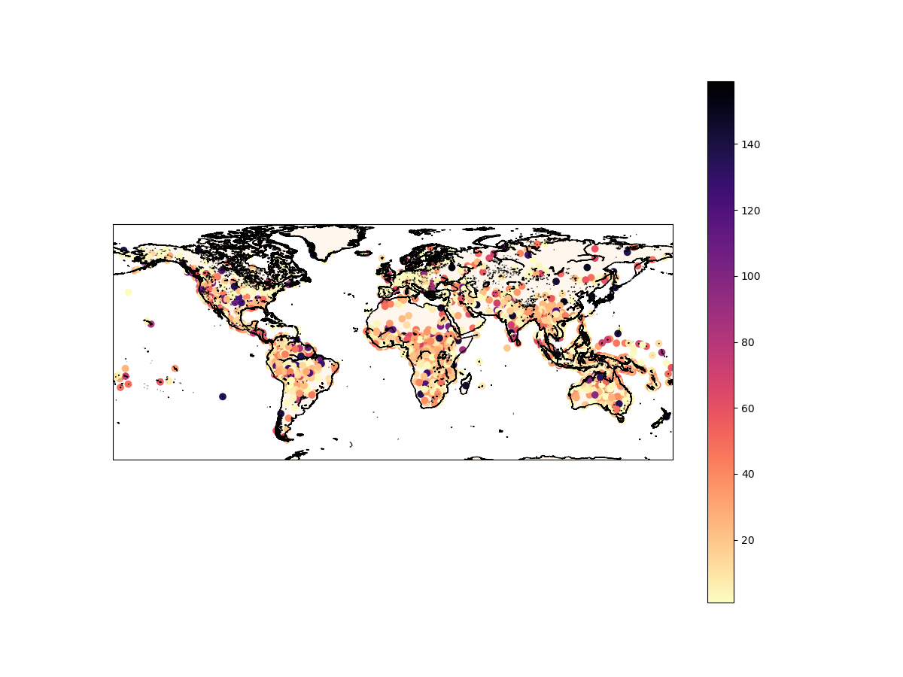

# Plot the representation of parameter values on a map

This recipe uses [`matplotlib`](https://matplotlib.org/) and 
[`matplotlib.basemap`](https://matplotlib.org/basemap/users/installing.html)
to plot color-coded datapoint numbers for languages in a CLDF dataset
on a geographical map.


## Usage

Requirements on Ubuntu or Debian Linux systems:

Install the following deb packages:
```
apt-get install libgeo-proj4-perl libgeos-3.4.2 libgeos++-dev
```

and python packages:
```
pip install numpy
pip install matplotlib
pip install pyproj
pip install pycldf
pip install pyglottolog
```

To install `mpl_toolkits.basemap`:
```
export GEOS_DIR=/usr
curl -O -J -L https://github.com/matplotlib/basemap/archive/v1.1.0.tar.gz
tar -xzvf basemap-1.1.0.tar.gz
cd basemap-1.1.0/
python setup.py install
```

If no geo coordinates are available in the CLDF dataset, the script tries to lookup
coordinates in Glottolog. This is done using `pyglottolog`, using the data in a local
clone or export of [clld/glottolog](https://github.com/clld/glottolog).

The script is run from the commandline using the following syntax:
```
$ python plot_representation.py --glottolog-repos PATH/TO/CLLD/GLOTTOLOG PATH/TO/DATASET/*-metadata.json OUTPUT.[png|svg]
```


## Example

This recipe can be used to visualize the 
[infamously sparse](http://www.replicatedtypo.com/visualising-language-typology-plotting-wals-with-heat-maps/5189.html) 
matrix of WALS datapoints



with the darker dots corresponding to 
[WALS 100 and 200 language samples](http://wals.info/chapter/s1#3.1._The_WALS_samples)


## Acknowledgements

Thanks to [@Anaphory](https://github.com/Anaphory/) for contributing this recipe.